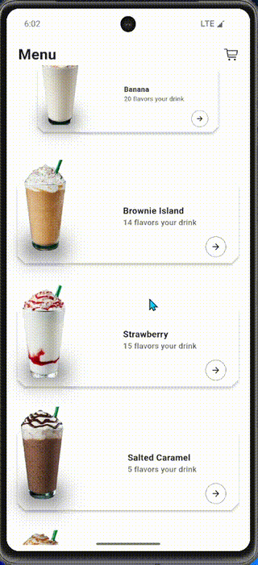

# 🚀 My Flutter App

An animated Flutter application that showcases smooth UI interactions and modern design.  
This project is focused on delivering a clean experience with eye-catching animations ✨.

---

## 🎥 Demo

  
*The animation above demonstrates the core interactions of the app.*

---

## ✨ Features
- Smooth and modern animations
- Responsive design
- Clean and maintainable code structure
- Built with Flutter 💙

---

## 🛠️ Technologies Used
- [Flutter](https://flutter.dev/)  
- [Dart](https://dart.dev/)  

---

## 📥 Installation
1. Clone the repository:
   ```bash
   git clone https://github.com/He9sham/coffee.git
